# Cognia Noir

Cognia Noir is a Notion and Zen-inspired Obsidian theme tuned to feel calm. Dark mode reads like Notion's surface palette at low light; light mode keeps the same restraint on warm off-white. Sidebars round into the canvas, the note panel lifts off a soft tray tone, and SF Pro carries every surface meant to be read for hours. On macOS with Translucent Window enabled, the chrome paints over real NSVisualEffectView vibrancy so the desktop wallpaper shows through.

  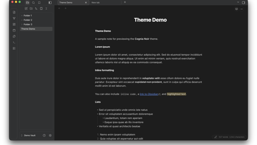

## Features

- Dark and light modes, both designed to feel like Notion's surface palette.
- Inter for UI chrome; SF Pro for note bodies; SF Mono for code.
- Rounded sidebars; the note panel lifts off a contrasting tray tone underneath.
- Native macOS vibrancy: enable Settings > Appearance > Translucent Window. The theme paints sidebars and chrome over `NSVisualEffectView` so the desktop wallpaper shows through.
- Plugin-safe vibrancy: Excalidraw and Smart Connections leaves are opted out of the translucent leaf-content force-paint so they render correctly. Core Canvas is also opted out as a defensive measure.
- WCAG AA contrast on primary text, accent, and inline code across all background options, dark and light.
- Honors `prefers-reduced-motion: reduce` (all transitions and animations disabled).
- Snappy hover and focus feedback (`100ms ease-out`) on nav titles, tab headers, links, inputs, buttons, and tags. State-change and layout transitions stay on a slower symmetric curve.

## Install

### From the Obsidian community store

1. Open Obsidian.
2. Settings > Appearance > Manage > Browse.
3. Search for "Cognia Noir".
4. Click Install, then Use.

### Manually

1. Download `manifest.json` and `theme.css` from the latest release.
2. Place them in `<your-vault>/.obsidian/themes/Cognia Noir/`.
3. In Obsidian: Settings > Appearance > select "Cognia Noir" under Theme.

## Compatibility

- Minimum Obsidian version: 1.5.0.
- Designed and tested on macOS only. Not tested on Windows or Linux. The macOS vibrancy effect requires NSVisualEffectView and will not apply on other platforms; other surfaces are unverified there.
- Mobile (iPad and phone): supported. iPad gets the full desktop chrome; phone scales appropriately.

## Gallery

### Overview

Lorem-ipsum demo note rendering in both modes: title, body copy, inline formatting (bold, italic, strikethrough, inline code, links, highlight), ordered and unordered lists.

| Dark | Light |
| --- | --- |
| 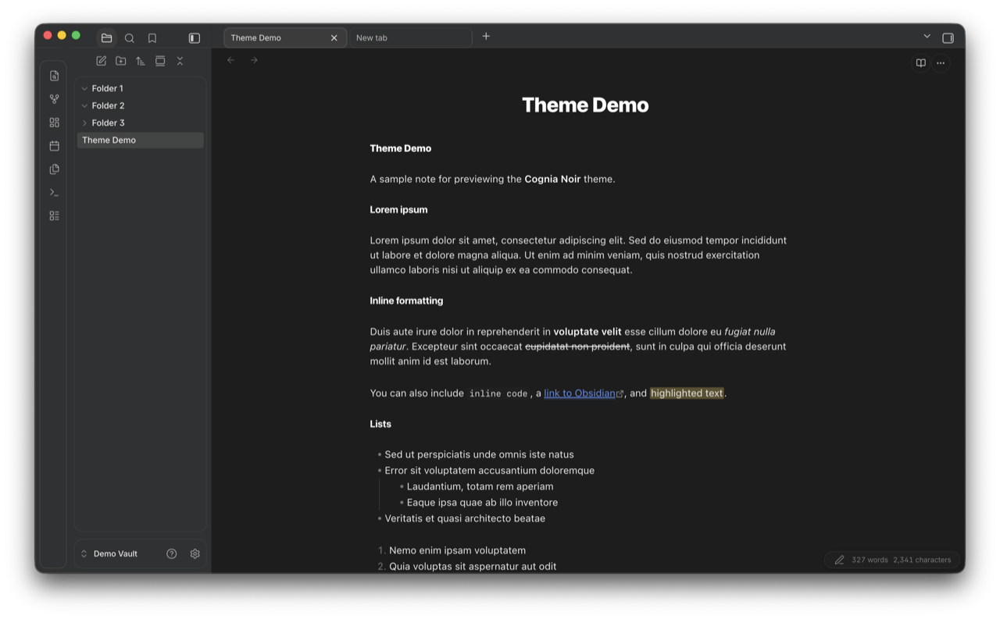 | 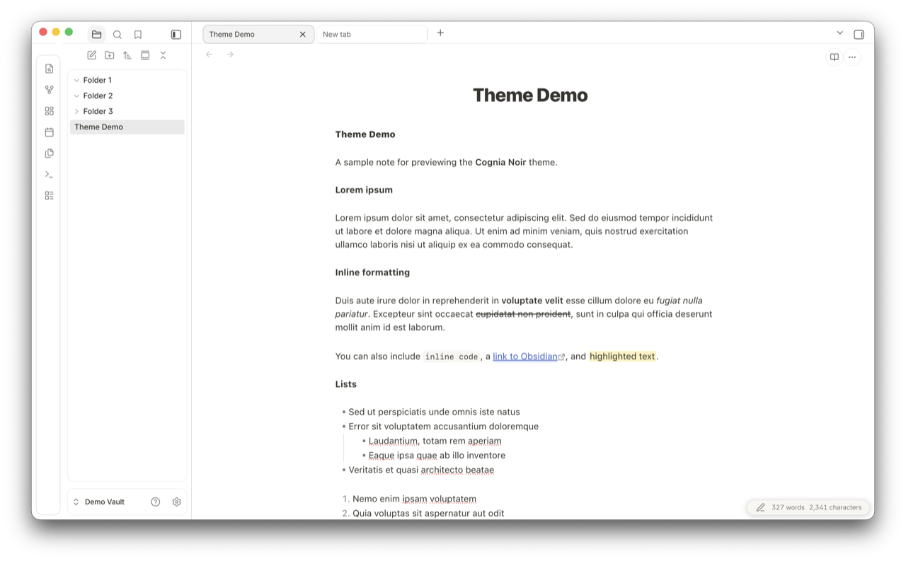 |

### Tasks, blockquote, callouts

Task list, blockquote, and the four built-in callout types (Note, Tip, Warning, Quote) with their accent colors.

| Dark | Light |
| --- | --- |
| 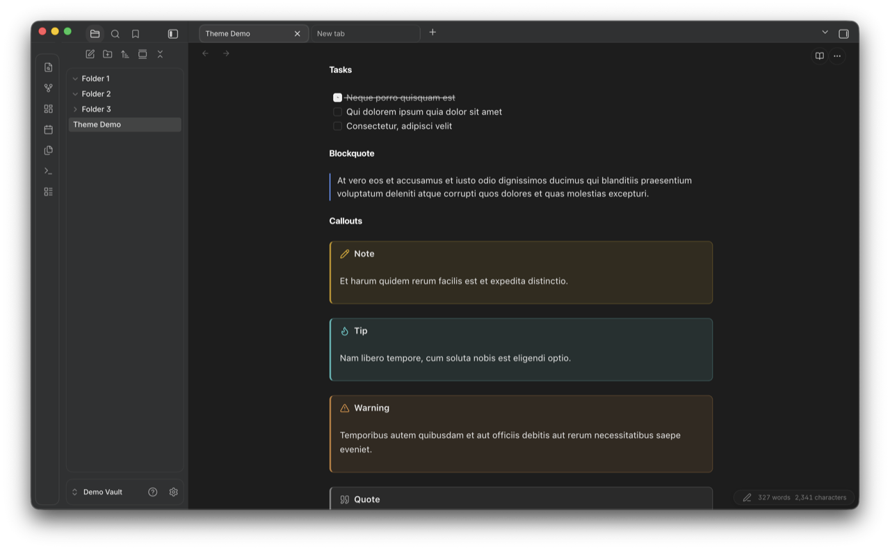 | 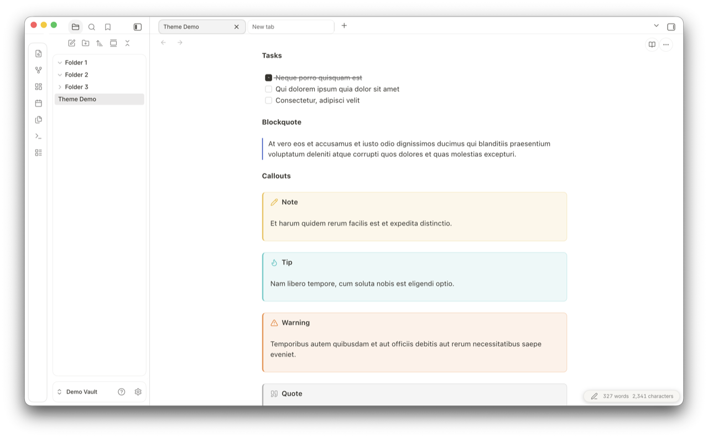 |

### Code blocks and tables

Fenced code blocks (Python and shell, language pill in the corner) and a Markdown table.

| Dark | Light |
| --- | --- |
| 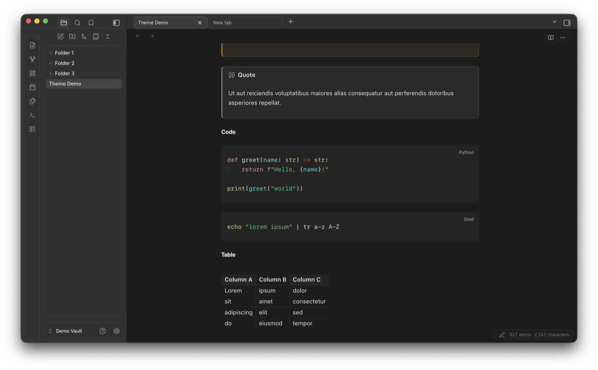 | 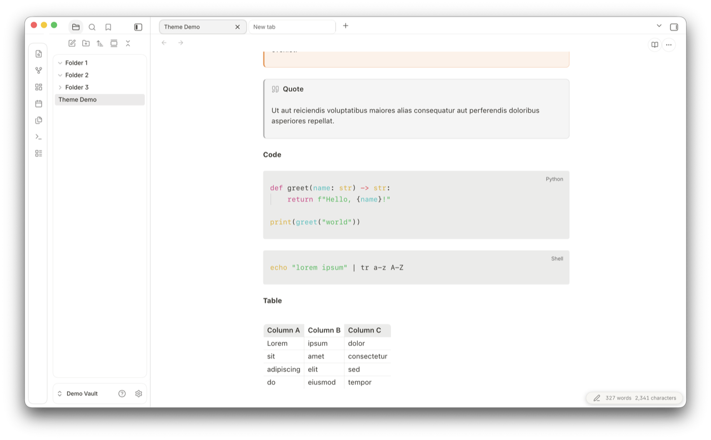 |

### Internal links, tags, math

Internal links with hover underline, tag pills with rounded background, inline LaTeX, and a centered display equation.

| Dark | Light |
| --- | --- |
| 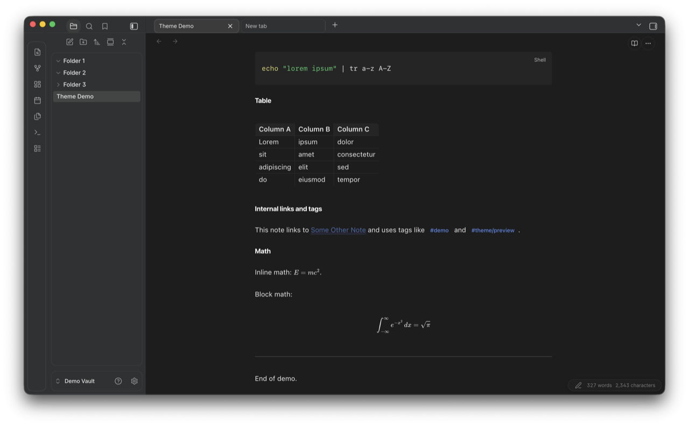 | 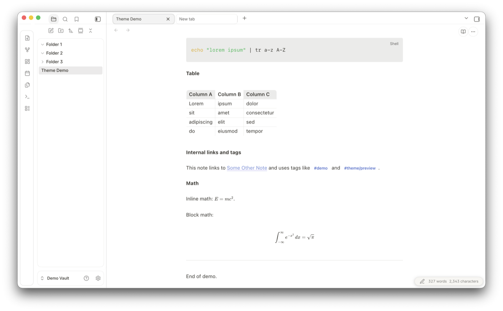 |

## Style Settings

If you have the [Style Settings](https://github.com/mgmeyers/obsidian-style-settings) plugin installed, Cognia Noir exposes 14 knobs under one "Look and feel" section. The lists below group them for readability; in the actual Style Settings panel they appear in one continuous scroll.

### Look and feel

- **Accent color**: used for links, focus rings, and selection. Defaults clear WCAG AA against each theme's canvas. Separate light and dark defaults.
- **Inline code color**: color of `inline code` text. Defaults clear WCAG AA against each theme's code background. Separate light and dark defaults.
- **Dark mode background**: Charcoal (default), Slate (neutral gray), Graphite (deep neutral), Pure black (OLED-friendly), True black (pure #000), Warm charcoal, or Zen. Applies only in dark mode.
- **Light mode background**: Paper (default, warm white), Pure white, Mist (light gray), Stone (deeper gray), Warm paper, or Zen. Applies only in light mode, independent of the dark setting.
- **Sidebar contrast**: how the sidebars separate from the main editor. Flat (default), Subtle border, or Lifted (slightly darker).
- **Translucency tint**: strength of the dark wash layered over macOS vibrancy. Pure vibrancy, Light, Medium (default), or Heavy. Pure shows raw vibrancy; Heavy dims it for legibility on bright wallpapers. Requires Settings > Appearance > Translucent Window enabled.
- **Heading scale**: Compact, Comfortable (default), or Large.

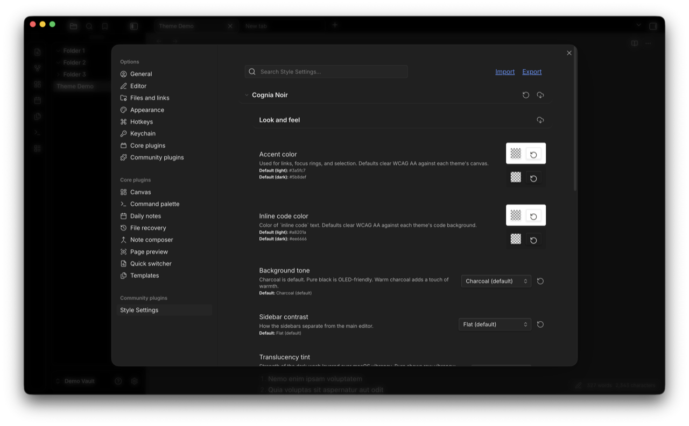

### Typography

- **Editor font size**: slider, 12 to 20 px (default 14).
- **UI font**: font for UI chrome (sidebars, tabs, buttons, dialogs). Inter (default), Avenir Next, or System (SF Pro).
- **Note font**: font for note content (editor and reading view). SF Pro (default), New York (Apple serif), Georgia (classic serif), or Avenir Next.
- **Heading font**: font for H1 through H6. SF Pro Display (default), New York, or Georgia. Pair with the note font for a matched look.
- **Note line height**: slider, 1.4 to 2.0 (default 1.65).

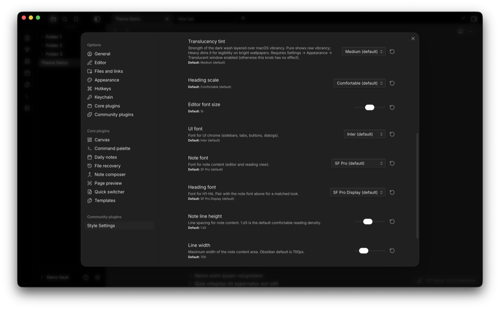

### Layout

- **Line width**: maximum width of the note content area. Slider, 500 to 1400 px (default 700, matching Obsidian's stock default).
- **Bubble nav buttons**: collapses the file explorer / bookmarks action row (new note, new folder, sort, expand) into a small pill that expands on hover. Inspired by Velocity.
- **Grayscale UI**: desaturates the theme's colors (accent, links, callouts, tags, highlight, inline code, status) so the interface reads as pure black and white. Note images and code syntax highlighting keep their color. Off by default.

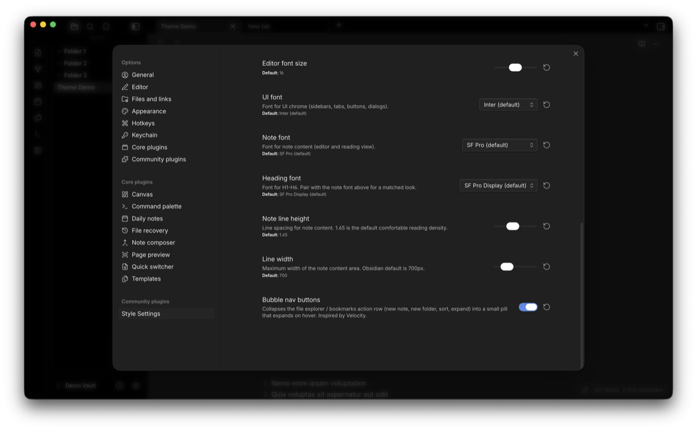

## Changelog

See [CHANGELOG.md](CHANGELOG.md) for the full per-version log. Highlights:

- **1.10.13**: Default accent and inline code now clear WCAG AA on every text-bearing surface in every default Background tone variant, not just Zen. Earlier audits had missed `bg-elevated` (modals, popovers, dropdowns); fixed for dark Charcoal, dark Warm, light Charcoal, and light Warm (full ratio table in `theme.css`). Kanban added to the translucent leaf-content force-paint opt-out chain. Bubble nav comment tightened. Modal-backdrop `!important` cluster documented. Empty `authorUrl` field removed from `manifest.json`.
- **1.10.12**: Zen Background tone reworked so the default accent and inline code clear WCAG AA on every Zen surface in both modes (full contrast table in `theme.css`). README WCAG note re-broadened to cover all default Background tone variants. Windows/Linux compatibility note clarified as untested. (A bubble nav animation change in this version was later reverted; see CHANGELOG.md for the current approach.)
- **1.10.11**: Excalidraw control reset narrowed (replaced `all: unset` with targeted overrides). Core Canvas added to the translucent leaf-content opt-out chain. Smart Connections reference comments corrected (data-type is the related-notes view, not a graph canvas). README narrowed the WCAG AA claim to the default Charcoal palette and clarified the Style Settings layout.
- **1.10.10**: removed a `display:none` rule that was hiding the sidebar resize handle. Added `--cn-transition-fast` (100 ms ease-out) for hover and focus feedback on nav titles, tab headers, links, inputs, buttons, and tags.
- **1.10.7**: added `prefers-reduced-motion: reduce` block.
- **1.10.6**: three Style Settings knobs (heading font, note font, color variants).
- **1.7.x**: initial Notion-inspired surface palette, rounded note and sidebar corners, macOS vibrancy support.

## License

MIT. See [LICENSE](LICENSE).

## Credits

Inspired by Notion's surface palette and macOS Sequoia's chrome. Built on conventions from the Obsidian theme dev community.

Several patterns and chrome shapes (top-bar tab pills, view-header buttons, bubble nav buttons, panel-box geometry) are Velocity-inspired. Translucency and color-variant techniques referenced AnuPpuccin's `translucency.scss`, the Things theme's `obsidian.css`, and Catppuccin's palette work during early prototyping. The Zen color variant takes its name and tone direction from the Zen browser. None of these themes' CSS is reproduced here; the patterns are reimplemented in this codebase. All visual code in this repo is original to Cognia Noir, licensed MIT.
